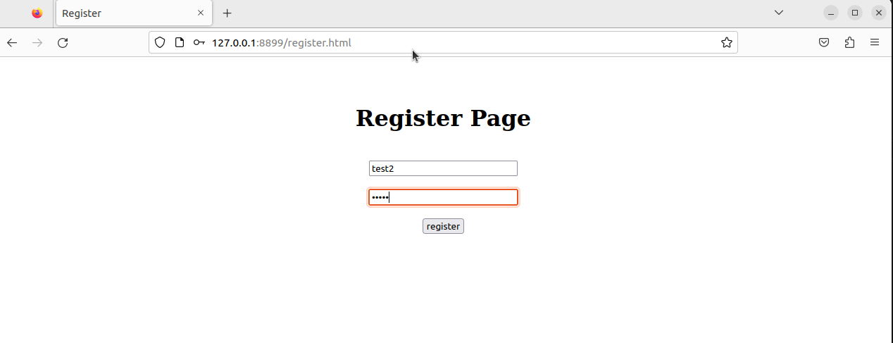
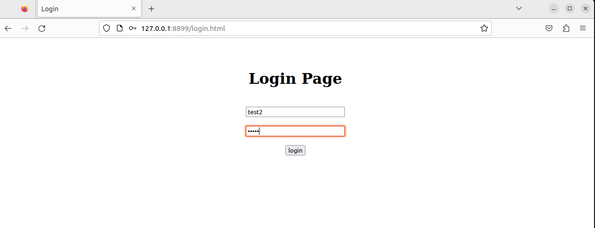
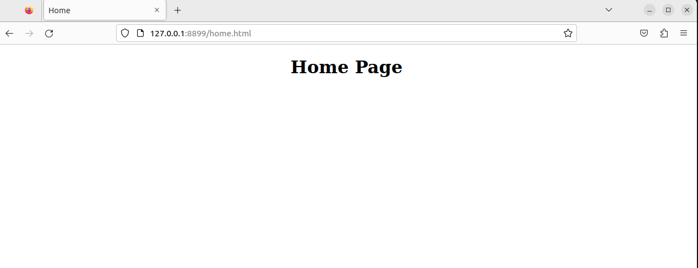
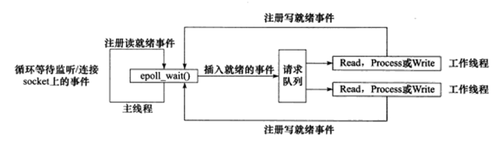
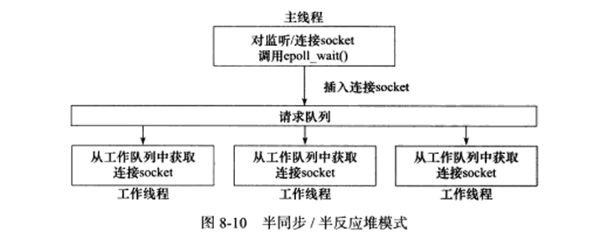
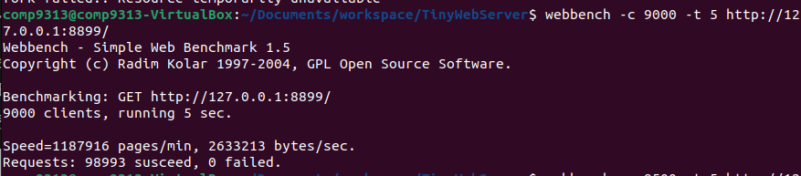

# 个人学习项目：TinyWebServer
使用C++编写Linux轻量级服务器，参考：《Linux高性能服务器编程》

## 项目概述
通过学习Linux服务器编程基础，搭建简易Web服务器，实现以下功能
- 解析HTTP请求，并根据URL返回对应本地资源（HTML页面）
- 实现注册/登录的API请求  
- 实现日志系统 
- 采用定时器，用于断开长时间没有活动的连接 
由于此项目主要用于学习Linux服务器编程基础，目前只有一个数据库表用于储存用户名和用户密码  
```sql
CREATE TABLE user(
    username char(50) NULL,
    passwd char(50) NULL
)ENGINE=InnoDB;
```  
## 技术概述
- 使用有限状态机实现HTTP报文的解析
- 使用epoll实现I/O复用（ET边缘触发），检测事件发生
- 事件处理模式选用Reactor
- 实现半同步/半反应堆并发模式
- 线程池中的线程通过竞争获得任务，使用信号量和互斥锁同步资源
- 数据库连接池使用单例模式保证唯一性，并使用RAII机制封装，自动释放数据库中的连接
- 日志使用单例模式保证唯一性
- 异步日志采用生产者消费者模式，当有日志需要输出时，先将其放入队列中，
写线程再将其写入日志文件中
- 定时器采用双向链表，链表内的定时器按expire排序

## Demo演示
`./server [-p port] [-l async_log] [-o opt_linger] [-s sql_conn_num] [-t thread_num] [-c close_log]`  
运行环境：Ubuntu22.4.1, MySql8.0.31  
默认参数：端口：8899，关闭日志：0，异步写日志：1，HTTP中的keep-alive：0，线程池中的线程
数量：8，数据库连接池中的数据库连接数量：8  
访问流程：在index page中选择register跳转到用户注册页面，注册成功后跳转到登录页面，登录成功时跳转到home页面  



  
## 参考

图片参考《Linux高性能服务器编程》
## 压力测试
  
在使用了HTTP中的keep-alive时，连接数目可以达到9000，访问时间为5s  
## 缺陷
- 与API相关的方法应单独实现，独立于http连接类
- 在I/O操作的结果返回前，程序会被阻塞。这是由于需要根据I/O操作的结果判断是否关闭连接。运行效率因此受影响
